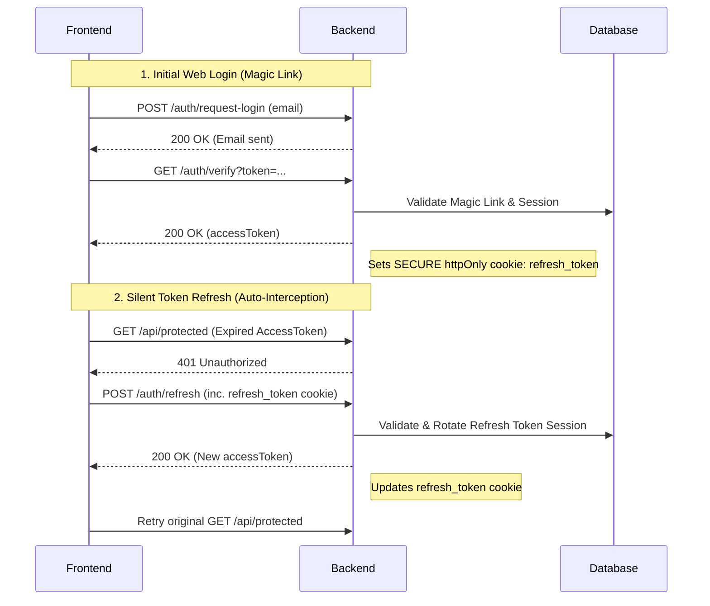
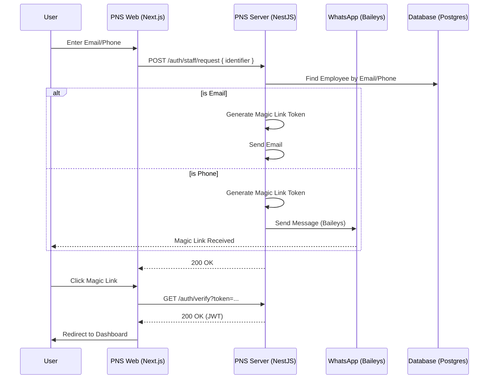

# PNS Server

A high-performance backend server built with Bun, NestJS, and Drizzle ORM.

## Tech Stack
- **Runtime:** [Bun](https://bun.sh/)
- **Framework:** [NestJS 11+](https://nestjs.com/)
- **ORM:** [Drizzle ORM](https://orm.drizzle.team/)
- **Database:** PostgreSQL
- **Documentation:** [Scalar UI](https://scalar.com/) (available at `/docs`)
- **Logging:** Pino

## Core Modules
- **Auth:** Magic Link login with "Access + Refresh Token" system, httpOnly cookies, and Role-Based Access Control (RBAC).
- **Products:** Product catalog, inventory management, and variant (package) tracking.
- **Purchases:** Supply chain management, restock flow with automatic HPP calculation, and stock ledger recording.
- **Orders:** Checkout and ordering transactions with automatic stock deduction.
- **Stock:** Centralized stock service for handling movements (Purchases, Orders, Repacks, Adjustments).
- **Repacks:** Split bulk products into smaller retail sizes (e.g., Bal to Small/Medium).
- **WhatsApp Notifier:** Embedded Baileys-based WhatsApp service for sending magic links and system notifications.

## Development

```bash
# Install dependencies
bun install

# Start development server
bun run start:dev

# Start production server
bun run start:prod
```

### Database Commands
- `bun run db:generate`: Generate migrations from schema
- `bun run db:migrate`: Apply migrations to database
- `bun run db:studio`: Open Drizzle Studio UI

### Automated Cleanup
- **Manual trigger**: `bun run cleanup`
- This project uses Husky, Knip, and ESLint to automatically remove unused imports and variables before every commit.

## API Documentation
The API documentation is fully typed and available via Scalar UI at:
`http://localhost:3000/docs`

## Authentication Architecture

The project implements a secure, best-practice authentication system using **Short-Lived Access Tokens** and **Long-Lived Refresh Tokens** stored in cookies.

### Token Strategy
- **Access Token**: Sent in the `Authorization: Bearer` header.
- **Refresh Token**: Sent via a **`httpOnly` Secure Cookie**. This token is stored in the database and is invisible to client-side JavaScript, making it immune to XSS theft.

### Sequence Diagram



### WhatsApp Login Flow

The system supports a unified staff login that automatically detects the input type (Email or Phone).


