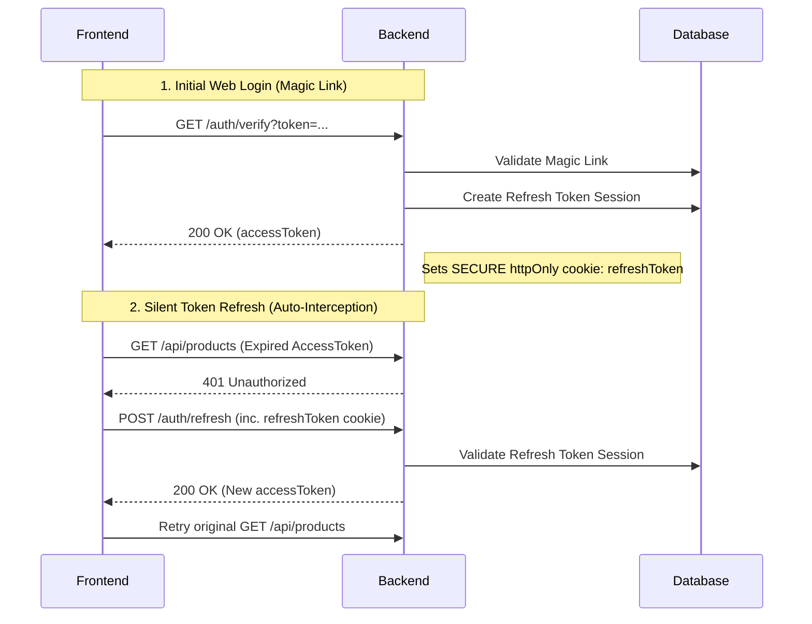

# PNS Server

A high-performance backend server built with Bun, Elysia, and Drizzle ORM.

## Tech Stack
- **Runtime:** Bun
- **Framework:** [ElysiaJS](https://elysiajs.com/)
- **ORM:** [Drizzle ORM](https://orm.drizzle.team/)
- **Database:** PostgreSQL (with `node-postgres`)
- **Logging:** Pino

## Core Modules
- **Auth:** Best-practice "Access + Refresh Token" system with httpOnly cookies and database persistence.
- **Products:** Product catalog and variant management.
- **Purchases:** Supply chain management, restock flow with automatic HPP calculation, and safe deletion of draft records.
- **Suppliers:** Supplier database management.
- **Orders:** Checkout and ordering transactions.

## Development

```bash
bun install
bun run dev
```

### Database Commands
- `bun run db:generate`: Generate migrations from schema
- `bun run db:migrate`: Apply migrations to database
- `bun run db:studio`: Open Drizzle Studio UI

### Automated Cleanup
This project includes a strict automated cleanup mechanism powered by **Husky**, **Knip**, and **ESLint**.

- **What it does**: automatically removes unused imports, variables, and **deletes unused files** before every commit.
- **Manual trigger**: `bun run cleanup`

```bash
vc deploy
```

## Authentication Architecture

The project implements a secure, best-practice authentication system using **Short-Lived Access Tokens** (15m) and **Long-Lived Refresh Tokens** (7d).

### Token Strategy
- **Access Token**: Sent in the `Authorization: Bearer` header. Stored in `localStorage`.
- **Refresh Token**: Sent via a **`httpOnly` Secure Cookie**. This token is stored in the database and is invisible to JavaScript, making it immune to XSS theft.

### Sequence Diagram


